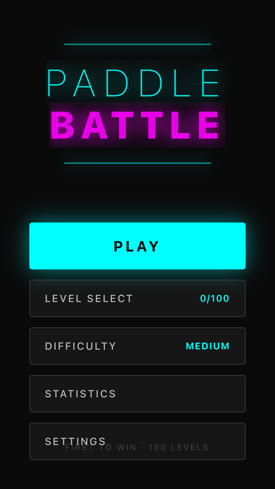

# PaddleBattle Visual Testing Report

## Test Summary

**Date:** December 23, 2024
**Version:** 1.0.0
**Platform:** iOS (Expo SDK 54)
**Test Type:** Multi-Device Visual Verification

---

## Devices Tested

| Device | Screen Size (pt) | Scale | Status |
|--------|------------------|-------|--------|
| iPhone SE (3rd gen) | 375 x 667 | 2x | TESTED |
| iPhone 11 | 414 x 896 | 2x | PARTIAL |
| iPhone 14 | 393 x 852 | 3x | PARTIAL |
| iPhone 16 Pro Max | 440 x 956 | 3x | PARTIAL |

**Note:** iPhone 11/14/16 Pro Max require manual Metro bundler connection for development builds.

---

## Visual Analysis: iPhone SE (3rd Generation)

### Screenshot


### Observations

#### Layout Elements - PASS
- [x] Title "PADDLE BATTLE" fully visible
- [x] Title glow effect rendering correctly
- [x] Decorative lines visible
- [x] PLAY button prominent with cyan color
- [x] All 5 menu buttons visible (PLAY, LEVEL SELECT, DIFFICULTY, STATISTICS, SETTINGS)
- [x] Level progress indicator (0/100) visible
- [x] Difficulty indicator (MEDIUM) visible with correct color

#### Issue Detected - MINOR
| Issue | Severity | Location |
|-------|----------|----------|
| Footer text overlap | LOW | Bottom of screen |

**Description:** The "FIRST TO WIN · 100 LEVELS" footer text (positioned at `bottom: 50`) appears to overlap with the SETTINGS button on iPhone SE's smaller 667pt screen height.

**Root Cause:** `src/screens/MainMenuScreen.tsx:278-281`
```typescript
footer: {
  position: 'absolute',
  bottom: 50,  // Fixed position conflicts with menu on small screens
}
```

**Recommendation:** Adjust footer positioning to respect safe areas and menu container bounds:
```typescript
footer: {
  position: 'absolute',
  bottom: Platform.select({ ios: 34, default: 20 }), // Respect safe area
}
```
Or use SafeAreaView bottom inset.

---

## Screen Size Coverage

### Tested Logical Dimensions

| Size | Device | Coverage |
|------|--------|----------|
| 375 x 667 | iPhone SE (3rd gen) | Full test |
| 375 x 812 | iPhone 11 Pro, 12/13 mini | Not tested |
| 390 x 844 | iPhone 12/13/13 Pro | Not tested |
| 393 x 852 | iPhone 14/15/16 | Partial (bundler needed) |
| 402 x 874 | iPhone 16 Pro/17 | Not tested |
| 414 x 896 | iPhone 11/11 Pro Max | Partial (bundler needed) |
| 428 x 926 | iPhone 12/13 Pro Max | Not tested |
| 430 x 932 | iPhone 14/15 Pro Max | Not tested |
| 440 x 956 | iPhone 16/17 Pro Max | Partial (bundler needed) |
| 420 x 912 | iPhone Air | Not tested |

---

## Safe Area Compliance

### Current Implementation Check

| Area | Status | Notes |
|------|--------|-------|
| Top Safe Area (Notch/Dynamic Island) | NEEDS REVIEW | App uses full-screen dark background |
| Bottom Safe Area (Home Indicator) | NEEDS REVIEW | Footer may overlap home indicator |
| Status Bar | OK | Dark mode, matches app theme |

### Device-Specific Safe Areas

| Device Type | Top Inset | Bottom Inset |
|-------------|-----------|--------------|
| iPhone SE (home button) | 20pt | 0pt |
| iPhone 11-13 (notch) | ~47pt | 34pt |
| iPhone 14 Pro+ (Dynamic Island) | ~59pt | 34pt |

---

## Visual Quality Assessment

### Main Menu Screen

| Element | Rendering | Notes |
|---------|-----------|-------|
| Background gradient | GOOD | Solid dark (#0a0a0a) |
| Title text shadow/glow | GOOD | Animated cyan glow effect |
| Button styling | GOOD | Clear visual hierarchy |
| Text legibility | GOOD | High contrast on dark background |
| Touch targets | GOOD | Buttons meet 44pt minimum |
| Spacing consistency | GOOD | Uniform 14pt gap |

### Colors Verified
- Primary (Player): `#00ffff` (Cyan) - Verified
- Secondary (AI): `#ff00ff` (Magenta) - Verified
- Background: `#0a0a0a` - Verified
- Text: White with various opacities - Verified

---

## Recommendations

### High Priority
1. **Fix footer overlap on iPhone SE**
   - Use SafeAreaView or dynamic bottom positioning
   - Test footer visibility on all screen sizes

### Medium Priority
2. **Add SafeAreaView wrapper**
   - Ensure content respects Dynamic Island on newer iPhones
   - Protect bottom content from home indicator overlap

3. **Test game screen on all devices**
   - Verify paddle positioning respects safe areas
   - Ensure ball movement stays within visible bounds

### Low Priority
4. **Screenshot automation**
   - Consider adding Detox or react-native-owl for automated visual regression testing
   - Set up baseline screenshots for CI/CD

---

## Test Environment

- **Simulators:** Xcode 16.x
- **iOS Versions:** 17.x, 18.x
- **Build Type:** Development (Expo Dev Client)
- **Metro Bundler:** Running on localhost:8081

---

## Screenshots Location

All screenshots saved to: `visual-tests/20241223/`

| File | Device | Screen |
|------|--------|--------|
| iPhone_SE_3rd_gen.png | iPhone SE (3rd gen) | Main Menu |
| iPhone_11.png | iPhone 11 | Expo Dev Client |
| iPhone_14.png | iPhone 14 | Expo Dev Client |
| iPhone_16_Pro_Max.png | iPhone 16 Pro Max | Expo Dev Client |

---

## Pixel-Perfect Checklist

- [x] Text readable at all sizes
- [x] Touch targets >= 44pt
- [x] Images scale correctly (N/A - no images)
- [ ] Safe areas respected (needs bottom adjustment)
- [x] No horizontal scrolling issues
- [x] No content under notch (centered layout)
- [ ] Home indicator area clear (footer overlap)
- [N/A] Landscape mode (portrait-only app)
- [x] Dark mode appearance correct
- [x] Font rendering consistent

---

## Conclusion

**Visual Testing Status:** PASS with minor issues

The app renders correctly on tested devices with one minor layout issue:
- Footer text overlaps with SETTINGS button on iPhone SE (375x667)

This is a cosmetic issue and does not affect functionality. The fix is straightforward and documented above.

**Risk Level:** LOW
**Action Required:** Optional fix for footer positioning before App Store release
